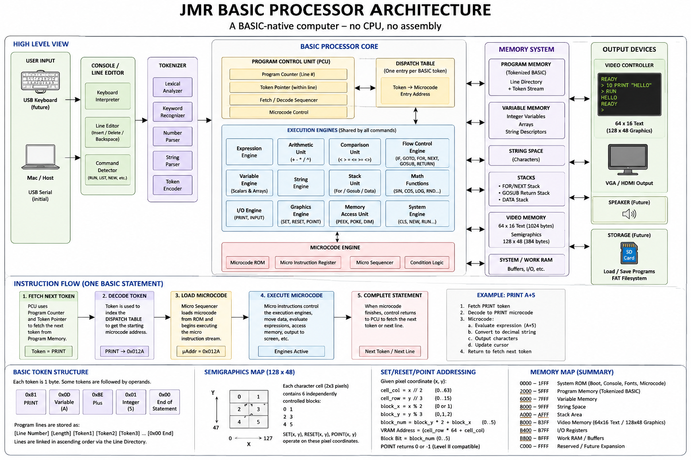

# Architecture



This document walks the diagram block by block and says where each block lives
in the Python Functional Model. Every block on the diagram has exactly one
module; every module corresponds to a block. That correspondence is the point —
it is what makes the SystemVerilog milestone a translation rather than a
redesign.

---

## The idea

A conventional computer executes assembly language, and assembly language
implements BASIC:

```
CPU  ->  interpreter  ->  BASIC
```

This machine reverses that. The BASIC token stream *is* the machine code:

```
BASIC  ->  processor
```

There is no layer underneath. `0x81` is not "the byte the interpreter checks
for", it is the PRINT opcode, and it selects a microcode routine the way an
opcode selects microcode in any microcoded processor.

---

## High level view

### User input → Console → Tokenizer

Keystrokes arrive over the UART (`uart.py`), which drops them into the Keyboard
Engine's FIFO (`engines/keyboard_engine.py`). The Console
(`console.py`) reads that FIFO, echoes through the Print Engine, and edits one
line in Work RAM.

The Console never touches the UART. That is deliberate: phase 2 replaces the
UART with a USB host filling the same FIFO, and the Console does not change.

When the line is finished, the **command detector** asks one question: does it
start with a line number? If it does, the tokenized line is filed in Program
Memory. If it does not, it is executed immediately from the direct statement
buffer. `RUN` is not special-cased anywhere — it is a statement like any other,
with a dispatch entry and a microcode routine.

The **Tokenizer** (`tokenizer.py`) is the diagram's five sub-units — lexical
analyzer, keyword recognizer, number parser, string parser, token encoder — and
it runs exactly once per line. After that the machine only ever sees tokens.
`detokenize()` is the same table read backwards, which is how `LIST` works.

### BASIC Processor Core

**Program Control Unit** (`sequencer.py`) holds the Program Counter (as a line
record address), the Token Pointer, and drives the fetch/decode/dispatch cycle.
It knows nothing about what any statement does.

**Dispatch table** (`microcode.py`, built by `MicrocodeAssembler.entry()`) maps
one token to one microcode entry address. `run_jmr.py --microcode` prints it:

```
PRINT    0x81 -> 0x0105
GOTO     0x85 -> 0x0127
FOR      0x88 -> 0x012f
```

**Microcode Engine** (`microcode.py` + `MicroSequencer` in `sequencer.py`) is a
ROM of micro-instructions, a micro-PC, a condition flag and branch logic. Each
BASIC command is a short routine of micro-operations that drive the engines.
The PRINT routine reads, in full:

```
LOAD_TEMP 0        TMP: no separator seen yet
PRINT_AT           optional PRINT@ cursor move
TEST_STMT_END
BRANCH_IF 0x010d
EVAL               evaluate the item
PRINT_VALUE        convert to characters, write to VRAM
PRINT_SEP          COND = a separator followed
BRANCH_IF 0x0107
TEST_TEMP          did the list end with , or ; ?
BRANCH_IF 0x0110
PRINT_NL
END_STMT
```

**Execution engines** are one module each under `functional_model/engines/`, and
they are shared, never duplicated:

| Diagram block | Module | Notes |
|---|---|---|
| Expression Engine | `expression_engine.py` | PRINT, LET, IF and FOR all use this one |
| Arithmetic / Comparison | `expression_engine.py` | operator application inside the same engine |
| Variable Engine | `variable_engine.py` | scalar slots in Variable Memory |
| Array Engine | `array_engine.py` | interface defined, arrives at step 18 |
| String Engine | `string_engine.py` | literals now, the rest at step 17 |
| Flow Control Engine | `flow_engine.py` | IF, GOTO, GOSUB, RETURN, FOR, NEXT, READ |
| Stack Unit | `memory.py` (`MemoryStack`) | one implementation, four stacks |
| I/O Engine | `print_engine.py`, `console.py` | PRINT and INPUT |
| Graphics Engine | `graphics_engine.py` | SET, RESET and POINT share one address decode |
| Memory Access Unit | `memory.py` | PEEK, POKE and every engine's reads |
| System Engine | `machine.py` | CLS, NEW, RUN, LIST, SAVE, LOAD |
| Math Functions | `expression_engine.py` | ABS, INT, SGN, RND today |

### Memory system

One flat 64K space (`memory.py`), divided by `memory_map.py`, which is the only
module allowed to contain an address literal. Program memory, variables, string
space, all four stacks, Video RAM, the I/O registers and the system pointers are
all *in* that space at documented addresses — not in Python objects beside it.
See [MEMORY_MAP.md](MEMORY_MAP.md).

This is why `PEEK` can read the cursor register and `POKE` can write the screen
without any special case: they are ordinary memory accesses.

### Output devices

The **Video Controller** (`engines/video_engine.py`) owns Video RAM, the cursor
register and scrolling. Text and graphics share one memory: a cell with bit 7
set is six graphics blocks instead of a character, which is what makes 64x16
text and 128x48 graphics the same 1024 bytes.

Speaker and storage: the Storage Engine exists (`engines/storage_engine.py`)
with a device backend behind it, so phase 2's microSD card is a new backend
class and nothing above it changes. Sound is future work.

---

## Instruction flow

The five steps along the bottom of the diagram, and where they are in the code:

| Step | Diagram | Code |
|---|---|---|
| 1 | Fetch next token | `ProgramControlUnit._locate_statement` |
| 2 | Decode token | `ProgramControlUnit._decode` |
| 3 | Load microcode | the dispatch table lookup in `_decode` |
| 4 | Execute microcode | `MicroSequencer.resume` |
| 5 | Complete statement | `Outcome.CONTINUE` handling in `step` |

A statement can also *stall* in step 4: `INPUT` runs out of typed characters, the
micro-PC stays where it is, and the machine reports `WAITING_INPUT` until the
Console has a line. That is a pipeline stall, not an exception, and it is why
`INPUT` works without the host having to block.

---

## What is deliberately not here

- **No hidden CPU.** Nothing in this repository evaluates BASIC source text.
  The only thing that reads text is the Tokenizer, once per line.
- **No merged engines.** Where merging would have been shorter — putting
  expression evaluation inside the PRINT routine, say — the Constitution
  forbids it, and the engines stay separate.
- **No recursive-descent parser.** The Expression Engine is a shunting-yard
  state machine with its stacks in addressable memory, because that is what
  ports to hardware. The recursive version would be shorter and unbuildable.
- **No floating point.** Stage 1 is 16-bit signed integer BASIC by
  specification; `1.5` is a syntax error rather than a silent approximation.
